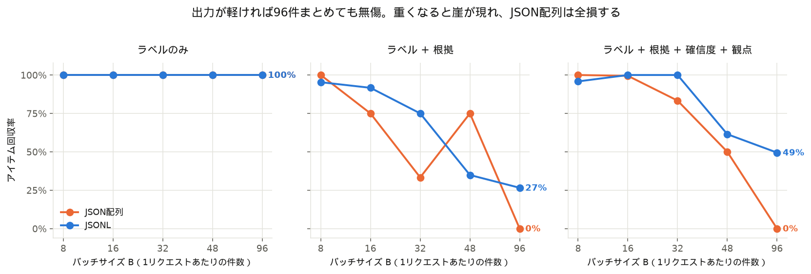
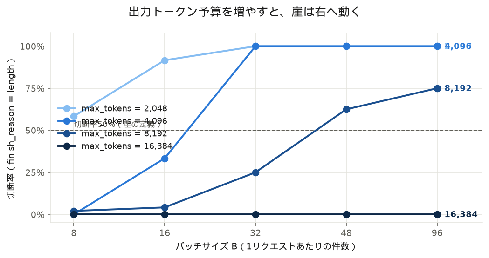
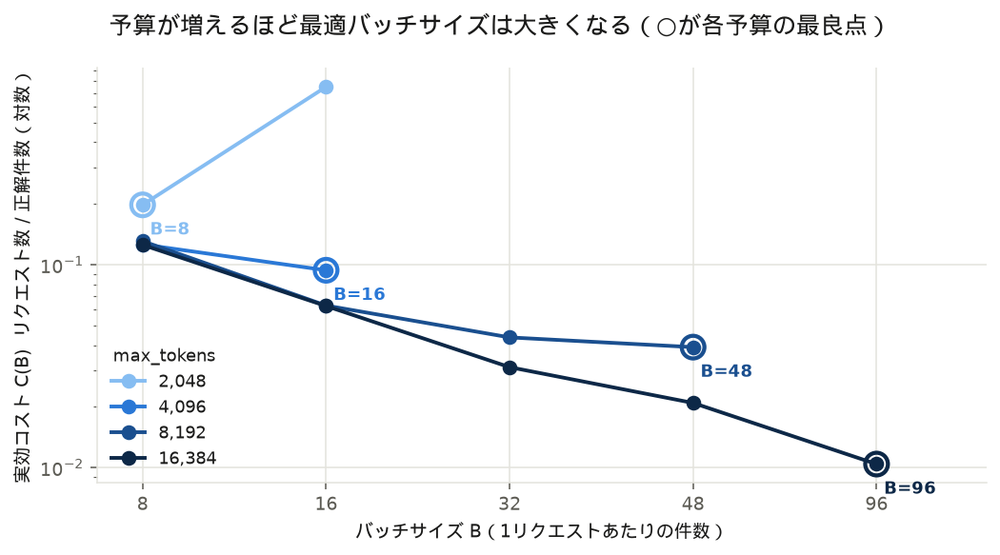
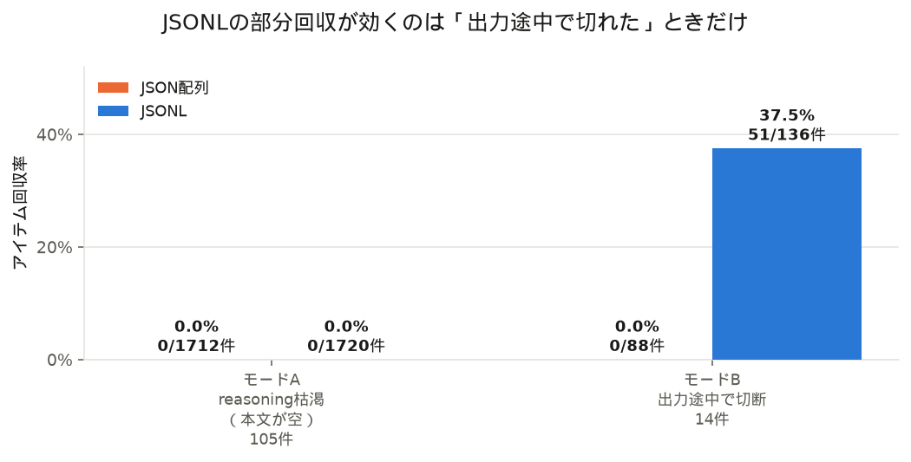
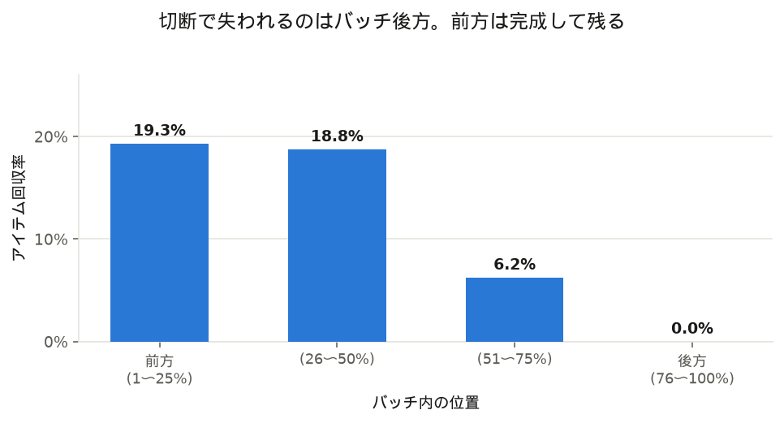

# 無償枠3,000リクエストで28万件処理できる — さくらのAI Engine でバッチサイズの限界を実測した

## TL;DR

- さくらのAI Engine の無償枠は**トークン数ではなくリクエスト数**で数える（Chat completions 月3,000回）。この前提では「1件ずつ投げる」設計が極端に非効率になる
- 96件を1リクエストにまとめても、**正解率100%・パース失敗ゼロ**。実効コストは8件ずつ投げた場合の**12分の1**になった。この効率が月3,000リクエスト続くなら **28.8万件**（タイトルの数字はこの外挿値。実測したのは192件分です）
- バッチが壊れる原因は「モデルが混乱すること」ではなく、**出力トークン予算の枯渇**（`finish_reason=length`）だった。JSON構造が破綻したケースは1件もない
- そして**必要な予算はバッチサイズにほとんど依存しない**。B=8 でも最大11,669トークン使うことがあった（思考の長さのばらつきが支配的）
- 結論: **`max_tokens` を最悪ケースに合わせて大きく取れば、バッチは大きいほど得**。「崖」は予算不足が作る人工物だった



検証は `gpt-oss-120b` に対して合計 **740リクエスト**（無償枠3,000の24.7%）で行いました。コードとログは[リポジトリ](https://github.com/Taiki0629/BatchEconomics)にあります。

---

## 背景: リクエスト課金だと設計の常識が反転する

OpenAI や Anthropic の API は入出力トークン数に比例した課金なので、こういう設計が常識になっています。

```python
for item in items:              # 100件なら100リクエスト
    classify(item)
```

分割してもトークン合計はほとんど変わらないので、**分割のコストがほぼゼロ**。そのうえ出力が単純で壊れにくく、失敗時のリトライも1件分で済み、並列化しやすい。だから「小さく分けて投げる」が正解でした。

ところが[さくらのAI Engine](https://ai.sakura.ad.jp/sakura-ai/ai-engine/)の無償枠は**リクエスト数**で数えます（2026年7月29日時点の公式表記）。

| API | 無償枠 |
|---|---|
| Chat completions | 月3,000リクエスト |
| Embeddings | 月10,000リクエスト |
| 音声認識 / 音声合成 | 各月50リクエスト |

基盤モデル無償プランでは、超過しても課金されず「レート制御がかかります」と明記されています。つまり**リクエストが希少資源**で、トークンは（無償枠の範囲では）いくら使っても同じです。

この世界では 1件1リクエストは月3,000件で頭打ちですが、B件まとめれば理論上 3,000×B 件を処理できます。ただしバッチを大きくすれば出力が壊れやすくなるはず。**どこに損益分岐点があるのか**を実測しました。

## 検証環境

| 項目 | 内容 |
|---|---|
| モデル | `gpt-oss-120b`（通常提供。2026-07-29 にコントロールパネルで利用可能を確認） |
| エンドポイント | `POST https://api.ai.sakura.ad.jp/v1/chat/completions`（OpenAI互換） |
| パラメータ | `temperature=0.0`, `stream=false` |
| データ | 自作の日本語レビュー96件（感情2値分類、positive/negative 各48件） |
| プラン | 基盤モデル無償プラン |

96件にしたのは、バッチサイズ 1/2/4/8/16/32/48/96 すべてで割り切れるからです。

### 中心指標: 実効コスト C(B)

```
C(B) = 消費リクエスト数（リトライ含む） ÷ 正しく処理できた件数
```

小さいほど良く、これは「1件処理するのに何リクエスト必要か」を表します。B=1 なら 1.0 が上限で、C(96)=1/96≒0.0104 が理論限界です。

**壊れた出力をリトライしない設計**にしました。パース失敗や欠落は「測定対象そのもの」なので、粘って成功させてしまうと劣化が観測から消えてしまいます（リトライしたのは429/5xx/タイムアウトのみ）。

## 結果1: 96件まとめても、軽い出力なら無傷だった

まず「ラベルだけ返す」タスクで測りました（数値は形式ごと。2試行の合計）。

| B | 消費req | 正解 | 回収率 | C(B) | 切断 |
|---|---|---|---|---|---|
| 8 | 24 | 192/192 | 100% | 0.1250 | 0 |
| 16 | 12 | 192/192 | 100% | 0.0625 | 0 |
| 32 | 6 | 192/192 | 100% | 0.0312 | 0 |
| 48 | 4 | 192/192 | 100% | 0.0208 | 0 |
| **96** | 2 | **192/192** | **100%** | **0.0104** | **0** |

完全に単調減少して理論限界に到達しました。**「バッチを大きくすると壊れる」という私の予想は外れ**、JSON配列でもJSONLでも、96件を1リクエストで完璧に処理しました。

これを月3,000リクエストに当てはめると **28.8万件**（推定：C(96)=0.0104 を線形に外挿した値。実測は192件分）。1件1リクエストなら3,000件なので、桁が2つ違います。

## 結果2: 壊れたのは「出力トークンが尽きたとき」だけだった

では何をすれば壊れるのか。要求する出力を重くしてみました。

| タスク | 出力内容 | B=8 | B=32 | B=96 |
|---|---|---|---|---|
| `label` | ラベルのみ | 100% | 100% | **100%** |
| `label_reason` | ラベル + 根拠20〜40字 | 100% | 100% | **0%** |
| `structured` | ラベル + 根拠 + 確信度 + 観点配列 | 100% | 100% | **40.6%** |

崩壊しました。ただし原因は予想と違って、**すべて `finish_reason = "length"`**、つまり `max_tokens` での打ち切りでした。

**JSON構造が破綻したケースは1件もありません。** 切断されなかったリクエストでは、パース失敗・ID不一致・欠落がほぼゼロ。「大きいバッチはJSONを壊す」という直感は、このモデル・このタスクでは成り立ちませんでした。

## 結果3: 崖は予算を増やせば右へ動く

原因が予算枯渇なら、予算を変えれば崖も動くはずです。`max_tokens` を4水準振りました（384リクエスト）。



| max_tokens | 崖の位置（切断率50%超の最小B） |
|---|---|
| 2,048 | B=8（すでに58%が切断） |
| 4,096 | B=32 |
| 8,192 | B=48 |
| 16,384 | **範囲内になし（B=96でも切断0件）** |

同じタスク・同じモデルで、変えたのは予算だけです。`max_tokens=2048` では最小のB=8ですでに半分以上が切断されたのに、**16,384では96件を1リクエストにしても切断ゼロ**（96リクエスト中0件、192/192件正解）。

## 結果4: 必要な予算はバッチサイズにほとんど依存しない

ここが一番意外でした。切断されなかったリクエストの実出力トークン量を見ます。

| B | 平均出力 | **最大出力** | 平均 tok/件 | 最大基準 tok/件 |
|---|---|---|---|---|
| 8 | 2,147 | **11,669** | 268.3 | 1,458.6 |
| 16 | 3,733 | 11,269 | 233.3 | 704.3 |
| 32 | 7,148 | 15,015 | 223.4 | 469.2 |
| 48 | 9,349 | 13,495 | 194.8 | 281.1 |
| 96 | 12,819 | **16,000** | 133.5 | 166.7 |

平均で見ると、1件あたりのトークンは 268 → 133 と半減します。思考（reasoning）のコストがバッチ全体でほぼ一定なので、**まとめるほど1件あたりに薄まる**わけです。これはバッチングが効く仕組みそのものです。

問題は最大値です。**B=8 でも最大11,669トークン**使っています。1件あたりに換算すると1,459トークン、平均の5.4倍です。思考の長さがリクエストごとに大きくばらつくため、**小さいバッチでも「たまたま長く考えた」1回で予算を使い切ることがある**。

つまり必要な予算の上限は、バッチサイズよりも**思考のばらつき**で決まっています。今回の全740リクエストで、完走した最大出力は16,000トークンでした。

そして最大基準の tok/件は 1,459 → 167 と、**バッチを大きくするほど下がります**。まとめるほど「1件が暴走するリスク」も薄まるということです。

## 結果5: C(B)の最小点は罠だった

`max_tokens` ごとに C(B) が最小になる B を出すと、予算とともに右へ動きます。



ところが**その最良点の中身を見ると危険**でした（JSONL形式）。

| max_tokens | C(B)最良のB | そこでの切断率 | 正解 |
|---|---|---|---|
| 2,048 | B=8 | **54%** | 122/192 |
| 4,096 | B=16 | **33%** | 128/192 |
| 8,192 | B=48 | **50%** | 102/192 |
| 16,384 | B=96 | **0%** | **192/192** |

予算が足りない条件では、C(B)を最小にする点は「**半分のリクエストが切断され、3〜5割の件数を失いながら、それでもリクエスト効率は最良**」という状態でした。リクエスト数だけ見れば最適でも、運用としては最悪です（レイテンシは長いのに成果が出ない）。

**予算が十分な16,384だけが、切断ゼロで最大バッチという素直な最適点**になりました。

ここから言えるのは、**C(B)を最小化するようにBを調整するのは筋が悪い**ということです。正しい順序は「まず予算を十分に取る、そのうえでBを大きくする」でした。崖は予算不足が作り出した人工物にすぎません。

## 結果6: 崩壊には2つのモードがあり、JSONLが効くのは片方だけ

切断されたリクエスト119件を中身で分類しました。



| モード | 件数 | JSON配列の回収率 | JSONLの回収率 |
|---|---|---|---|
| **A. reasoning枯渇**（本文が0文字） | 105件（88%） | 0.0%（0/1,712件） | **0.0%（0/1,720件）** |
| **B. 出力途中で切断** | 14件（12%） | 0.0%（0/88件） | **37.5%（51/136件）** |

**モードA** は、予算のすべてを思考が消費して**本文を1文字も出力しなかった**ケースです。`max_tokens=2048` では全96リクエスト中64件（67%）がこの状態でした。**モデルは予算に合わせて思考を短くしてくれません。**

**モードB** は出力途中で切れたケースで、ここでのみ形式差が出ます。JSON配列は配列が閉じないため `json.loads` が全体で失敗して**1件も救えません**。JSONLは行ごとに独立して復元できるので、完成済みの行がそのまま使えます。

reasoning枯渇の比率は予算が厳しいほど上がりました（2,048で86%、4,096で97%、8,192で77%、16,384で0%）。**予算をケチると、部分回収すらできない全損になる**わけです。

## 結果7: 欠落はバッチ後方に集中する

切断時に、バッチ内のどの位置が失われるかを見ました。



| 位置 | 回収率 |
|---|---|
| 前方（1〜25%） | 19.3% |
| 26〜50% | 18.8% |
| 51〜75% | 6.2% |
| 後方（76〜100%） | **0.0%** |

生成が前から順に進んで打ち切られるので当然ですが、実務的には2つ使えます。**重要なアイテムはバッチの前方に置く**、そして**欠落を検出したら失敗分だけ再投入すればよい**（全件やり直す必要はない）。

なお当初は「後方ほど**誤答**が増える」と予想していました（Lost in the Middle の類推）。しかし誤答はほとんど発生せず、位置効果は**誤答ではなく欠落**として現れました。

## 結果8: レイテンシもバッチングで改善する

1件あたりの処理時間です（`label_reason` タスク）。

| B | 8 | 16 | 32 | 48 | 96 |
|---|---|---|---|---|---|
| 1件あたり | 1,196ms | 1,172ms | 943ms | 704ms | **346ms** |

3.5倍速くなりました。理由は同じで、思考のオーバーヘッドが1件あたりに薄まるためです。リクエスト課金では「まとめると速くなる」が成立します。

## 実務への落とし込み

実測から導いた手順です。

### 1. まず `max_tokens` を最悪ケースに合わせる（順序が重要）

Bを調整する前にこれをやります。小さいバッチで試して、**平均ではなく最大**の出力トークン数を見ます。

```python
# 実測した usage から最悪ケースを把握する
observed = [r["usage"]["completion_tokens"] for r in responses]
print(f"平均 {sum(observed)/len(observed):.0f} / 最大 {max(observed)}")
# → 今回は B=8 で 平均2,147 / 最大11,669。最大は平均の5.4倍
```

トークン課金でないなら、`max_tokens` を大きく取っても損はありません（未使用分は請求されない）。**ここをケチると全損モードに落ちます。**

### 2. そのうえでバッチを大きくする

予算が足りていれば、Bは大きいほど得です。データ量とレイテンシ許容度で決めて構いません。

```python
def estimate_batch_size(max_tokens: int, worst_tokens_per_item: float) -> int:
    """最悪ケースのtok/件から安全なバッチサイズを見積もる。
    tok/件はBが大きいほど下がるので、この式は保守的な下限を与える。"""
    return max(1, int(max_tokens / worst_tokens_per_item))
```

### 3. 出力はJSONL形式にする

コストゼロの保険です。効くのは切断ケースの一部（今回は12%）だけですが、掛け捨てにはなりません。

```python
def parse_jsonl(content: str) -> tuple[list[dict], int]:
    """行ごとに復元する。壊れた行は捨てて、完成した行だけ回収する。"""
    records, broken = [], 0
    for line in content.splitlines():
        line = line.strip()
        if not line:
            continue
        try:
            records.append(json.loads(line))
        except json.JSONDecodeError:
            broken += 1          # 切断された最後の行はここに落ちる
    return records, broken
```

同じ入力で比べると差は明快です（実行結果）。

```
入力: '{"id":"d-001","label":"positive"}\n{"id":"d-002","label":"neg'
JSONL    → 1件回収, 破損1行
JSON配列 → JSONDecodeError（全損）
```

### 4. `finish_reason` を必ず監視する

`length` が出たら予算不足です。欠落した分だけ再投入します。返ってきたIDと送ったIDを突き合わせれば、何が落ちたかは分かります。

### 5. 崖ぎりぎりを狙わない

崖の周辺では切断が確率的に起きるので、C(B)が上下に振れて不安定になります。余裕を持たせるほうが運用は安定します。

## 制約・注意点

この結果をそのまま一般化しないでください。

- **モデルは `gpt-oss-120b` の1種類のみ。** reasoning の量はモデルごとに違うので、必要予算も崖の位置も変わります
- **タスクは日本語の感情分類のみ。** 入力が長い場合や、より複雑な出力構造では傾向が変わりえます
- **同一の96アイテムを全条件で再利用**しているため、観測は完全に独立ではありません
- **各セル2試行**と少なく、切断は確率的に起きるため、崖の位置には±1水準程度の不確かさがあります
- **完走した最大出力16,000トークンは、`max_tokens=16384` の上限に近い値**です。真の最悪ケースはこれより大きい可能性があります（観測できていません）
- `max_tokens=16384` での最適Bは観測範囲の上限（B=96）に張り付いており、**真の最適はさらに大きい可能性**があります（データが96件しかないため未検証）
- **28.8万件という数字は外挿**です（タイトルにも使っています）。実測したのは192件分の処理で、この効率が月3,000リクエスト分そのまま続く前提の計算です
- 無償枠の仕様（2026年7月29日確認）は変更されえます。**RAG（ドキュメント）機能だけは無償プランでも課金対象**なので注意してください

## 再現手順

```bash
git clone https://github.com/Taiki0629/BatchEconomics
cd BatchEconomics
cp .env.example .env        # SAKURA_API_KEY=<UUID>:<シークレット> を記入
uv sync

# 送信計画の確認（APIを叩かない）
uv run python 30_development/run_main.py --run-id p3-002 --max-tokens 8192 --dry-run

# 消費量の確認
uv run python 30_development/tally_budget.py
```

無償枠を消費する実行には上限をコードで強制してあります（超えると送信が拒否されます）。ログは1リクエストにつき「送信前」「応答後」の2行を書く write-ahead 方式にしており、Ctrl-Cや電源断でも消費の記録が失われません。

消費実績は合計740リクエスト（無償枠3,000の24.7%）でした。

| run | 内容 | リクエスト |
|---|---|---|
| p3-001 | 試走（疎通・reasoning挙動の確認） | 18 |
| p3-000 / p3-000b | 探索（どこで壊れるかの特定） | 50 |
| p3-100 | 本実験（3タスク × 5水準 × 2形式 × 2試行） | 288 |
| p3-200 | 追試（max_tokens 4水準） | 384 |

## 付録: セットアップでハマったこと

同じ検証をする人向けに、公式ドキュメントを読んだだけでは気づきにくかった点を挙げます（すべて2026年7月29日に実機で確認）。

**無償枠だけ使う場合でもクレジットカード登録は必須です。** さくらのクラウドのアカウント要件で、公式マニュアルに「ご利用にはクレジットカードによるお支払いのみ」と明記されています。カード以外はプリペイド（法人・文教分野限定）と銀行振込（例外時）のみで、個人利用では回避できません。ただし登録自体で課金は発生しません。

**AI Engine のコントロールパネルは別URLです。** さくらのクラウドの管理画面（`secure.sakura.ad.jp/cloud/`）からは辿れず、`secure.sakura.ad.jp/ai/` を直接開く必要があります。

**RAG（ドキュメント）機能だけは無償プランでも課金対象です。** プラン選択画面にこう書かれています。

> 基盤モデル無償プランにおいても、RAGで使用するドキュメントを登録した際には、ドキュメントを削除するまでチャンク数に応じた課金が継続的に毎月発生しますのでご注意ください

3円/100チャンクで、削除するまで毎月続きます。無償枠で試すだけのつもりなら、左メニューの「ドキュメント (RAG)」には触らないほうが安全です。

**アカウントトークンは一度しか表示されません。** 「このトークンは再度表示されません」と警告が出ます。画面を閉じると作り直しになります。形式は `<UUID>:<シークレット>` で、これを丸ごと `Authorization: Bearer` に載せます。

**プレビューモデルのIDには `preview/` プレフィックスが必要です。** サービス紹介ページには `Kimi-K2.6` と書かれていますが、APIに渡すIDは `preview/Kimi-K2.6` でした。コントロールパネルの「利用可能なモデル」画面が正です。

**モデルは入れ替わります。** 参考にした資料に載っていた `Qwen3-Coder-480B-A35B-Instruct-FP8` と `Qwen3-Coder-30B-A3B-Instruct` は、この時点の一覧に存在しませんでした（コード系は `preview/Kimi-K2.7-Code` に置き換わっていました）。**古い記事のモデルIDをそのままコピーしないほうがいいです。**

**消費量はコントロールパネルで確認できます。** 「利用量」またはアカウントトークンの詳細画面に、モデルごとの日次グラフがあります。手元のログと突き合わせておくと安心です。

## おわりに

一番の収穫は、**当初の仮説が完全に外れたこと**でした。「バッチを大きくすると出力が壊れてU字カーブになる」と予想して実験を組んだのに、96件まとめても壊れませんでした。

そこで探索し直して分かったのが「壊れるのは予算が尽きたときだけ」で、さらに掘ると「必要な予算はバッチサイズにほとんど依存しない（思考のばらつきが支配的）」という、当初想定していなかった構造でした。

結果として指針はシンプルになりました。**`max_tokens` を最悪ケースに合わせて大きく取る。そのうえでバッチは大きくする。出力はJSONLにする。** リクエスト課金では、これだけで効率が桁で変わります。

---

*実験コード・生ログ・集計スクリプトはすべて[リポジトリ](https://github.com/Taiki0629/BatchEconomics)にあります。記事中のすべての数値は `40_test/` のログから機械的に集計したもので、外挿値には明示的にラベルを付けています。*
