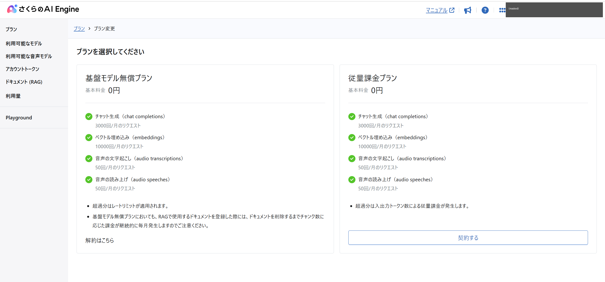
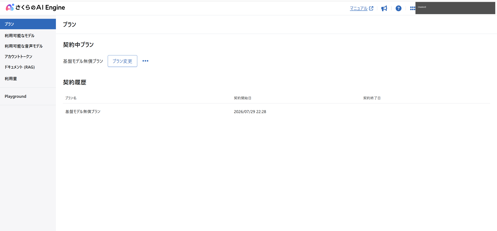
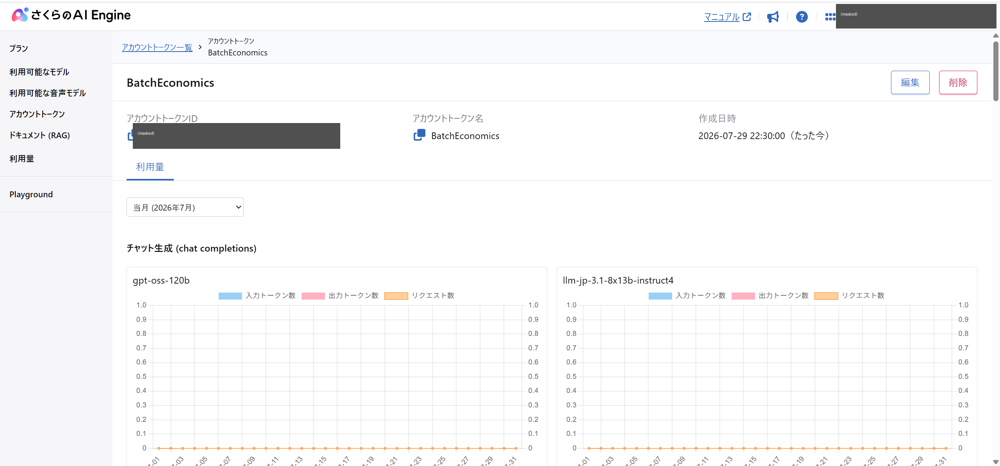

# 【記事素材】さくらのAI Engine のセットアップ手順とハマりどころ

> Qiita 記事の「試す前に」セクションの下書き。P5 で本文に統合する。
> 実施日 2026-07-29 の実体験に基づく。公式仕様への言及はすべて同日確認。

## TL;DR（このセクションだけ読む人向け）

- 無償枠を使うだけでも**クレジットカード登録は必須**（さくらのクラウドのアカウント要件）
- プランは **「基盤モデル無償プラン」を選ぶ**。超過しても課金されず、レートリミットがかかるだけ
- ただし **RAG（ドキュメント）機能だけは無償プランでも課金される**。触らないこと
- **アカウントトークンは一度しか表示されない**。その場でコピーする
- プレビューモデルの ID には **`preview/` プレフィックスが必要**

## 所要時間

アカウント新規作成から API を叩ける状態まで、実測で**約1時間**（会員登録・電話認証・カード登録を含む）。既にさくらのクラウドを使っているなら 5〜10 分程度で終わる。

## 手順

### 1. 前提を揃える

公式マニュアルの[利用手順](https://manual.sakura.ad.jp/cloud/ai-engine/02-howto.html)によると、次が必要になる。

- さくらインターネット会員ID
- 電話による本人認証
- さくらのクラウド プロジェクト
- **クレジットカードの登録**（「ご利用にはクレジットカードによるお支払いのみ」と明記）

ここは事前に知っておきたかった点で、**無償枠だけ試したい場合でもカード登録は回避できない**。カード以外の支払い方法はプリペイド（法人・文教分野限定）と銀行振込（カードで支障が出た場合等）のみで、個人利用では実質カード一択になる。

なお、会員登録自体は無料で、リソースを作らなければ請求は発生しない。詳細は[さくらのクラウド ご利用開始手順](https://manual.sakura.ad.jp/cloud/payment/signup.html)。

### 2. AI Engine のコントロールパネルを開く

👉 https://secure.sakura.ad.jp/ai/

さくらのクラウドのコントロールパネルとは**別のURL**である点に注意。クラウド側の画面から辿ろうとすると迷う。サービス紹介ページ（`ai.sakura.ad.jp/sakura-ai/ai-engine/`）からもリンクがある。

### 3. プランを選ぶ — ここが唯一の課金の分岐点



2つのプランが並ぶ。**基本料金はどちらも0円**で、無償枠の数値（チャット3,000回/月、埋め込み10,000回/月、音声50回/月）も同じ。違うのは**枠を超えたときの挙動**だけ。

| プラン | 超過時 |
|---|---|
| 基盤モデル無償プラン | 「超過分はレートリミットが適用されます」 |
| 従量課金プラン | 「超過分は入出力トークン数による従量課金が発生します」 |

検証目的なら**基盤モデル無償プラン**が安全。実験スクリプトが暴走しても、課金ではなくレートリミットで止まる。公式にも「ご利用中のプランが自動で切り替わることはありません」と明記されており、勝手に有料へ移行することはない。

#### ⚠️ 唯一の例外：RAG は無償プランでも課金される

同じ画面に、見落としやすい注意書きがある。

> 基盤モデル無償プランにおいても、RAGで使用するドキュメントを登録した際には、ドキュメントを削除するまでチャンク数に応じた課金が継続的に毎月発生しますのでご注意ください。

料金は 3円 / 100チャンク。**左メニューの「ドキュメント (RAG)」には触らないこと。** 一度登録すると削除するまで毎月課金が続く。

契約すると、プラン画面はこうなる。



### 4. アカウントトークンを発行する

左メニュー「アカウントトークン」→ 右上「アカウントトークンを作成」→ 名前を入力 → 「作成する」。

🔴 **表示されたトークンはその場でコピーする。** 公式に「このトークンは再度表示されません」と警告があり、画面を閉じると作り直しになる。

トークンの形式は `<UUID>:<シークレット>`。これを丸ごと `Authorization: Bearer <トークン>` ヘッダーに載せる。

```bash
export SAKURA_API_KEY='<UUID>:<シークレット>'

curl https://api.ai.sakura.ad.jp/v1/chat/completions \
  -H "Authorization: Bearer $SAKURA_API_KEY" \
  -H 'Content-Type: application/json' \
  -d '{"model":"gpt-oss-120b","messages":[{"role":"user","content":"こんにちは"}]}'
```

> ⚠️ このコマンドは実際に無償枠を1リクエスト消費する。実行前に消費計画を立てること。

### 5. 使えるモデルを確認する

左メニュー「利用可能なモデル」に、モデルIDと単価の一覧がある。**ここを見ないと正確なモデルIDが分からない**ので、必ず確認したい。

2026-07-29 時点で確認できたチャット生成モデル:

| モデルID | 入力 / 出力（円 / 1万トークン・税込） |
|---|---|
| `gpt-oss-120b` | 0.15 / 0.75 |
| `llm-jp-3.1-8x13b-instruct4` | 0.15 / 0.75 |
| `preview/Kimi-K2.6` | 0.60 / 3.00 |
| `preview/Kimi-K2.7-Code` | 0.52 / 5.04 |
| `preview/Qwen3.6-35B-A3B` | 0.30 / 1.50 |
| `preview/Qwen3-VL-30B-A3B-Instruct` | 0.10 / 0.30 |
| `preview/gemma-4-31B-it` | 0.24 / 0.96 |
| `preview/Qwen3-0.6B-cpu` | 0.01 / 0.03 |
| `preview/Phi-4-mini-instruct-cpu` | 0.01 / 0.03 |

（単価は従量課金プランのもの。無償プランでは枠内で課金されない）

ここで**2つの落とし穴**に気づいた。

1. **プレビューモデルには `preview/` プレフィックスが要る。** サービス紹介ページには `Kimi-K2.6` と書かれているが、API に渡すIDは `preview/Kimi-K2.6`。プレフィックスなしで投げると失敗する
2. **モデルは入れ替わる。** 記事や資料で見かけた `Qwen3-Coder-480B-A35B-Instruct-FP8` や `Qwen3-Coder-30B-A3B-Instruct` は、この時点の一覧に存在しなかった（コード系は `preview/Kimi-K2.7-Code` に置き換わっていた）。**古い記事のモデルIDをそのままコピーしない方がいい**

また、ステータスが「要申請」のモデルは個人アカウントでは使えず、法人・団体アカウントへの切り替えが必要という注意書きもある。

### 6. 消費量を確認できるようにしておく

左メニュー「利用量」、またはアカウントトークンの詳細画面で、モデルごとの入力/出力トークン数とリクエスト数が日次グラフで見られる。



リクエスト課金の検証では**この画面が答え合わせになる**。手元のログで数えたリクエスト数と、ここの表示が一致するかを確認しておくと安心できる（特に、429やエラーレスポンスが枠にカウントされるかは公式仕様に記載がないため、実測で確かめる価値がある）。

## ハマりどころまとめ

| つまずき | 対策 |
|---|---|
| 無償枠だけ使いたいのにカード登録を求められる | 回避できない。さくらのクラウドのアカウント要件 |
| クラウドのコントロールパネルから AI Engine に辿り着けない | `secure.sakura.ad.jp/ai/` は別URL。直接開く |
| 無償プランなのに課金された | RAG（ドキュメント）機能を使っていないか確認。ここだけは無償枠がない |
| トークンを控え忘れた | 再表示不可。作り直すしかない |
| モデルIDを指定したのに動かない | プレビューモデルは `preview/` プレフィックスが必要。一覧画面で正確なIDを確認する |
| 記事で見たモデルが存在しない | プレビューモデルは入れ替わる。コントロールパネルの一覧が正 |

---

### 素材メモ（P5 で削除する）

- スクリーンショットは `90_resources/setup_screenshots/`（匿名化済み。加工内容は同ディレクトリの README 参照）
- 元画像は `31_環境構築/` にあるが個人情報を含むため `.gitignore` 済み
- 会員登録フローの画面は公開対象から除外（公式マニュアルで足りるため）
